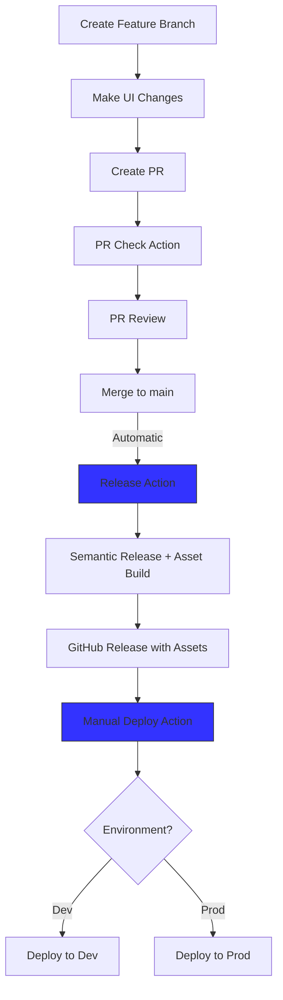

# Release Process

## Workflow

## Required Configuration

### GitHub Repository Variables
Set these in: Repository Settings > Secrets and variables > Actions > Variables

| Variable | Description | Example |
|----------|-------------|---------|
| `DEV_ENDPOINT` | Development API endpoint | `https://api.dev.example.com` |
| `PROD_ENDPOINT` | Production API endpoint | `https://api.prod.example.com` |

### GitHub Repository Secrets
Set these in: Repository Settings > Secrets and variables > Actions > Secrets

| Secret | Description |
|--------|-------------|
| `GITHUB_TOKEN` | Automatically provided by GitHub |

### Semantic Release Configuration
`.releaserc` configuration determines version bumping:
- patch (0.0.x): for fixes
- minor (0.x.0): for features
- major (x.0.0): for breaking changes

## Release Process Details

1. **Development**
   - Create feature branch from main
   - Make changes
   - Push branch

2. **Pull Request**
   - Create PR to main
   - PR Check action verifies build
   - Review and approve
   - Merge to main

3. **Automatic Release**
   - Triggered on merge to main
   - Semantic Release determines version
   - Builds both dev and prod assets
   - Creates GitHub release with assets

4. **Deployment**
   - Manual trigger via Deploy action
   - Choose environment (dev/prod)
   - Optional: specify version (defaults to latest)

## Rollback Process
1. Go to Actions > Deploy
2. Run workflow
3. Select environment
4. Enter specific version to rollback to

## Common Issues

### Missing Environment Variables
If builds fail with missing endpoint errors:
1. Check repository variables
2. Verify variable names match workflow files
3. Ensure proper access permissions

### Failed Releases
If semantic-release fails:
1. Verify commit messages follow conventional commits
2. Check GitHub token permissions
3. Review action logs for specific errors